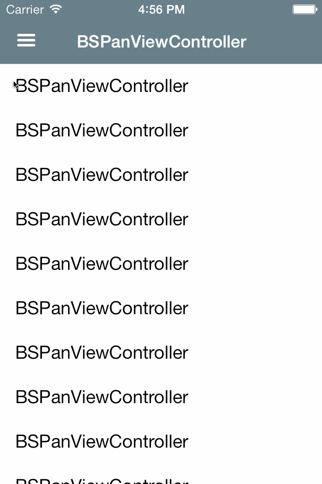

# BSPanViewController

BSPanViewController is my take on the popular side menu. You can have a controller to be revealed in both the left and the right side. 
You can optionally have the controller move the status bar along with the main view. This is shown in the animation below where the status bar moves with the view when opening the left side but stays in place when opening the right side.
The controller also makes it easy to add and configure a parallax effect when opening and closing the sides. The parallax effect is optional.

  

## Requirements

- BSPanViewController requires ARC to be enabled. If you are not already using ARC, now is a good time.
- The control does only support iOS 7.

## Installation

If  you are using CocoaPods (which you should!) you can just add the following to your podfile and run `pod install`.

	pod 'BSPanViewController', :git => 'https://github.com/simonbs/BSPanViewController.git'

If you are not not using CocoaPods, you should clone this repository and copy BSPanViewController/ directory into your project.

When you have installed BSPanViewController either using CocoaPods or not, you just need to import the `BSPanViewController.h`.

	#import "BSPanViewController.h"

## Usage

Using BSPanViewController is easy peasy. You just initialize an instance of BSPanViewController and then you will (usually) set it as the root view controller on your instance of `UIWindow` in the app delegate.

If you want to use the pan gesture you must enable this using `leftPanEnabled` and `rightPanEnabled`.

You set `mainController` which is the controller which can be dragged. That is, it is the top most controller. `leftController` and `rightController` are both shown below the main controller. These are the controllers that can be revealed when dragging the main controller. You can have both a left and a right controller or just one of them.

	self.panController = [BSPanViewController new];
    self.panController.leftPanEnabled = YES;
    self.panController.rightPanEnabled = YES;
    self.panController.mainController = navigationController;
    self.panController.leftController = [LeftViewController new];
    self.panController.rightController = [RightViewController new];
    
BSPanViewController has a lot of settings which can be set independently for the left and the right side. Please take a look at `BSPanViewController.h` for more information on the settings.

The control works with `UIViewControllerBasedStatusBarAppearance` set to `YES` or `NO`. If you have the value set to `YES` you might want to subclass BSPanViewController and implemenet `-preferredStatusBarStyle` to decide the style of the status bar.

## Known Issues

- There are issues with the colors of the snapshot taken of the status bar when your navigation bar is translucent.

Let me know if you find anything else.

## Demo Project

The repsitory contains a simple example project. This project was used to create the animation shown above.

## Credits

BSPanViewController is developed by [@simonbs](http://twitter.com/simonbs), [simonbs.dk](http://simonbs.dk) Feel free to fork the repository and send pull requests if you have made something awesome.

## License

BSPanViewController is released under the MIT license. Please see the LICENSE file for more information.